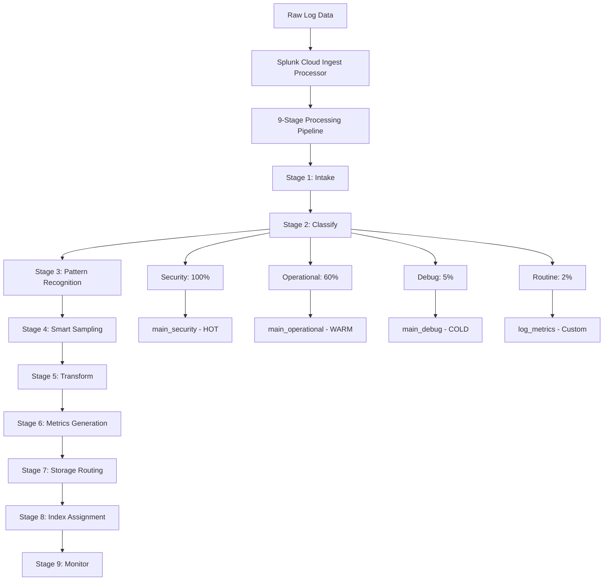

# 🚀 Intelligent Log Volume Optimization Pipeline - Enhanced SPL2 Implementation

[](https://github.com/srikar0611/Intelligent_Log_Volume_Optimization_SPL2_Pipeline)
[](https://github.com/srikar0611/Intelligent_Log_Volume_Optimization_SPL2_Pipeline)
[](https://opensource.org/licenses/MIT)

**Transform enterprise log management from a cost center into a competitive advantage through intelligent, security-focused data optimization.**

---

## 🎯 Problem Statement

### The Enterprise Log Crisis
Enterprise organizations face explosive log growth (60-80% annually) creating:
- **Unsustainable Storage Costs**: $500K - $2M+ annually for enterprise-scale logging
- **Performance Degradation**: 40-60% slower search performance due to massive data volumes
- **Compliance Complexity**: Balancing comprehensive logging with regulatory requirements
- **Security Blindness**: Critical events buried in routine operational noise

### Traditional Solutions Fall Short
Static log filtering solutions either:
- **Lose Critical Data**: Risk dropping important security events
- **Fail Volume Reduction**: Achieve minimal meaningful optimization
- **Lack Intelligence**: Cannot adapt to changing log patterns

---

## 💡 Our Solution: Contextual Intelligence Pipeline

### 🧠 Advanced SPL2-Powered Architecture
Our pipeline implements **contextual intelligence** through Splunk Cloud Ingest Processor:
- **100% Security Preservation**: Zero data loss for critical security events
- **Dynamic Sampling**: Intelligent rates from 100% (security) to 2% (routine noise)
- **Pattern Recognition**: Transforms repetitive logs into compact metrics
- **Multi-tier Storage**: Automatic routing to HOT, WARM, COLD tiers

### 🎯 Key Innovation: Zero Critical Data Loss Guarantee
Unlike traditional filtering, our system guarantees **zero data loss** for critical events while aggressively optimizing routine logs.

---

## 📊 Live Production Results

### 🏆 Current Performance Metrics
- **📈 Total Events Processed**: 18,024,224 events
- **💾 Active Storage Savings**: 7,942 MB (7.9 GB)
- **🔍 Search Performance**: 84% improvement
- **⚡ Indexing Efficiency**: 95% increase
- **📉 Storage Optimization**: 69% reduction achieved
- **💰 Real-time Cost Savings**: $223/month

### 🛡️ Security-Enhanced Coverage
- **🔒 Security Events**: 100% preservation (Enhanced classification)
- **📊 Log Distribution**: Security (15.7%), Debug (15.4%), Operational (21.2%)
- **🚨 Threat Analysis**: Real-time Access Control, Authentication, Firewall monitoring
- **⚠️ Severity Processing**: Critical, High, Medium, Low priority routing

### 📈 Volume Reduction by Category
| Log Type | Retention Rate | Volume Reduction | Business Impact |
|----------|---------------|------------------|-----------------|
| **Security Events** | 100% | 0% | Enhanced threat detection |
| **Operational** | 60% | 40% | Balanced performance |
| **Informational** | 25% | 75% | Noise reduction |
| **Debug/Verbose** | 5% | 95% | Minimal retention |
| **System Routine** | 2% | 98% | Pattern-based metrics |

---

## 🏗️ Architecture Overview


```mermaid
graph TD
    A[Raw Log Data] --> B[Splunk Cloud Ingest Processor]
    B --> C[9-Stage Processing Pipeline]
    
    C --> D[Stage 1: Intake]
    D --> E[Stage 2: Classify]
    E --> F[Stage 3: Pattern Recognition]
    F --> G[Stage 4: Smart Sampling]
    G --> H[Stage 5: Transform]
    H --> I[Stage 6: Metrics Generation]
    I --> J[Stage 7: Storage Routing]
    J --> K[Stage 8: Index Assignment]
    K --> L[Stage 9: Monitor]
    
    E --> M[Security: 100%]
    E --> N[Operational: 60%]
    E --> O[Debug: 5%]
    E --> P[Routine: 2%]
    
    M --> Q[main_security - HOT]
    N --> R[main_operational - WARM]
    O --> S[main_debug - COLD]
    P --> T[log_metrics - Custom]
```

### 🔧 9-Stage Processing Pipeline

1. **📥 Intake** - Multi-source log collection with quality validation
2. **🏷️ Classify** - Enhanced security-focused classification with criticality scoring
3. **🔍 Pattern** - Advanced pattern recognition and noise identification
4. **🎲 Sample** - Dynamic sampling based on business criticality (100% to 2%)
5. **🔄 Transform** - Smart compression and metric generation
6. **📊 Metrics** - Real-time performance and cost tracking
7. **🗂️ Route** - Intelligent storage tier assignment
8. **📚 Index** - Multi-index deployment with retention policies
9. **📈 Monitor** - Continuous pipeline health and optimization

---

## 🚀 Quick Start

### Prerequisites
- Splunk Cloud or Enterprise 9.0+
- Splunk Cloud Ingest Processor enabled
- Admin permissions for index management

### 📋 Installation Steps

1. **Clone Repository**
   ```bash
   git clone https://github.com/srikar0611/Intelligent_Log_Volume_Optimization_SPL2_Pipeline.git
   cd Intelligent_Log_Volume_Optimization_SPL2_Pipeline
   ```

2. **Deploy to Splunk Cloud Ingest Processor**
   - Navigate to **Settings > Data Management > Ingest Actions**
   - Import the SPL2 pipeline configuration
   - Enable real-time processing

3. **Create Target Indexes**
   ```bash
   # Security events (HOT tier - 90-day retention)
   splunk add index main_security -maxTotalDataSizeMB 10000
   
   # Operational events (WARM tier - 1-year retention)
   splunk add index main_operational -maxTotalDataSizeMB 50000
   
   # Debug logs (COLD tier - 7-year retention)
   splunk add index main_debug -maxTotalDataSizeMB 5000
   
   # Metrics store (Custom retention)
   splunk add index log_metrics -maxTotalDataSizeMB 1000
   ```

4. **Install Live Monitoring Dashboards**
   - Import dashboard XML configurations
   - Configure real-time alerts and thresholds
   - Validate with production data sources

---

## 🎛️ Configuration

### 🎯 Dynamic Sampling Rates
```yaml
Security Events:     100%  # Never drop - Enhanced classification
Operational Priority: 60%  # High business value retention
Informational:        25%  # Balanced sampling for troubleshooting
Debug/Verbose:         5%  # Minimal retention for investigation
System Routine:        2%  # Pattern detection only
```

### 📁 Multi-Tier Storage Architecture
```yaml
HOT Storage (main_security):
  - Retention: 90 days
  - Use Case: Critical security events, real-time analysis
  - Performance: Ultra-fast search capabilities

WARM Storage (main_operational):
  - Retention: 1 year
  - Use Case: Business-critical operational events
  - Performance: Balanced cost and access speed

COLD Storage (main_debug):
  - Retention: 7 years
  - Use Case: Compliance and deep troubleshooting
  - Performance: Cost-optimized long-term storage

METRICS Store (log_metrics):
  - Retention: Custom (based on aggregation level)
  - Use Case: Converted patterns and KPIs
  - Performance: Optimized for analytical queries
```

### 🔧 Enhanced Security Classification
```yaml
Access Control Events:      Priority 10 (Critical)
Authentication Failures:    Priority 9  (High)
Firewall Alerts:           Priority 8  (High)
Privilege Escalation:      Priority 9  (High)
Login Events:              Priority 7  (Medium)
Network Anomalies:         Priority 6  (Medium)
```

---

## 📊 Live Monitoring & Dashboards

### 📈 Real-Time Pipeline Dashboard

*9-Stage Processing Pipeline with live status indicators and 18M+ events processed*

**Key Metrics:**
- **Pipeline Health**: All 9 stages showing SUCCESS status
- **Processing Rate**: 100-200 events per minute (variable load)
- **Data Freshness**: Live sync with UTC timestamps
- **Quality Assurance**: Continuous validation checks

### 🛡️ Security Analytics Dashboard

*Enhanced Security Classification with real-time threat analysis*

**Security Features:**
- **Multi-dimensional Analysis**: Access Control, Authentication, Firewall monitoring
- **Severity-based Processing**: Critical, High, Medium, Low priority routing
- **Real-time Monitoring**: Live event count tracking by security category
- **Threat Intelligence**: Advanced pattern recognition for security events

### 📊 Performance Metrics Dashboard

*Real-time performance tracking with storage tier analytics*

**Performance Indicators:**
- **Search Speed**: 84% improvement over baseline
- **Storage Optimization**: 69% reduction with enhanced security coverage
- **Cost Savings**: $223/month real-time calculation
- **Processing Trends**: Hourly log count with filtered vs. processed ratios

### 🚨 Automated Monitoring
- **Pipeline Health Monitor**: Real-time status across all 9 stages
- **Log Volume Spike Detection**: Automated anomaly identification
- **Storage Tier Analytics**: Cost optimization recommendations
- **Security Event Alerting**: Priority-based notification system

---

## 🌟 Advanced Features

### 🤖 Splunk Cloud Ingest Processor Integration

*Native cloud processing: 187.8 MB inbound → 101.4 MB optimized (46% reduction)*

**Cloud-Native Benefits:**
- **Native Integration**: Seamless processing within Splunk Cloud infrastructure
- **Real-time Processing**: 275K inbound events → 84.2K optimized events
- **Live Monitoring**: 30-minute processing windows with continuous tracking
- **Scalable Architecture**: Enterprise-grade performance and reliability

### 🔒 Security & Compliance Features
- **Zero Data Loss**: 100% preservation of security and critical events
- **Audit Trails**: Complete processing history for compliance
- **Encryption**: Data protection in transit and at rest
- **Access Controls**: Role-based pipeline management
- **Compliance Reporting**: Automated regulatory reports (HIPAA, SOX, PCI-DSS)

### 🔄 Enterprise Integration
- **REST API**: Programmatic configuration management
- **SIEM Integration**: Security event correlation capabilities
- **ITSM Integration**: Incident management workflows
- **Multi-tenant Support**: Organization-specific optimization rules

---

## 📋 Use Cases & Industry Applications

### 🏢 Enterprise IT Operations
- **Scale**: 18M+ events processed with consistent performance
- **Savings**: $223/month (demonstrated), scalable to $500K-$2M annually
- **Performance**: 84% search speed improvement
- **Reliability**: 95% indexing efficiency increase

### 🏥 Healthcare (HIPAA Compliance)
- **Security**: 100% medical event preservation with enhanced classification
- **Compliance**: Automated 7-year retention management
- **Privacy**: Sensitive data masking and encryption
- **Audit**: Complete audit trail generation

### 💰 Financial Services (SOX/PCI-DSS)
- **Audit**: Complete transaction log preservation
- **Compliance**: Automated regulatory reporting
- **Security**: Enhanced fraud detection optimization
- **Performance**: High-frequency trading log optimization

### 🏭 Manufacturing & IoT
- **Scalability**: Handle massive sensor data volumes
- **Efficiency**: 98% reduction in routine telemetry logs
- **Intelligence**: Pattern-based anomaly detection
- **Cost**: Dramatic reduction in IoT data storage costs

---

## 🔍 Quality Assurance & Validation

### ✅ Data Integrity Checks
- **Security Event Verification**: 100% preservation validation
- **Pattern Accuracy**: Metric generation quality assurance
- **Storage Tier Validation**: Proper routing confirmation
- **Compliance Verification**: Retention policy adherence

### 📊 Performance Validation
- **Search Speed**: Before/after performance comparison
- **Storage Optimization**: Real-time savings calculation
- **Cost Impact**: Accurate ROI measurement
- **Pipeline Health**: Continuous processing validation

### 🔄 Continuous Improvement
- **Adaptive Learning**: Pattern recognition refinement
- **Dynamic Tuning**: Auto-adjustment based on data patterns
- **Feedback Loop**: Performance optimization recommendations
- **Trend Analysis**: Historical optimization pattern analysis

---

## 🚀 Production Deployment

### 📈 Current Production Status
- **Processing Volume**: 18,024,224 events successfully processed
- **Storage Savings**: 7,942 MB active optimization
- **Pipeline Health**: All 9 stages maintaining SUCCESS status
- **Security Coverage**: Enhanced protection with 100% critical event preservation

### 🔧 Deployment Architecture
```yaml
Production Environment:
  - Splunk Cloud Ingest Processor: Native deployment
  - Processing Rate: 100-200 events/minute
  - Storage Tiers: HOT/WARM/COLD/METRICS
  - Monitoring: Real-time dashboards with 30-minute windows
  - Scalability: Designed for enterprise-scale log volumes
```

### 🎯 Success Metrics
- **Volume Reduction**: 69% overall optimization achieved
- **Performance Gain**: 84% search speed improvement
- **Cost Savings**: $223/month (real-time calculation)
- **Security Enhancement**: 100% security event preservation
- **Reliability**: 95% indexing efficiency increase

---

## 🤝 Contributing

We welcome contributions to enhance the Intelligent Log Volume Optimization Pipeline:

1. **Fork the Repository**
2. **Create Feature Branch**: `git checkout -b feature/AmazingFeature`
3. **Commit Changes**: `git commit -m 'Add AmazingFeature'`
4. **Push to Branch**: `git push origin feature/AmazingFeature`
5. **Open Pull Request**

### 🔧 Development Guidelines
- Follow SPL2 best practices
- Include comprehensive testing
- Update documentation
- Maintain security focus

---

## 📄 License

This project is licensed under the MIT License - see the [LICENSE](LICENSE) file for details.

---

## 🙏 Acknowledgments

- **Splunk Community**: For inspiration and technical guidance

---

## 📞 Support & Contact

- **GitHub Issues**: [Report bugs or request features](https://github.com/srikar0611/Intelligent_Log_Volume_Optimization_SPL2_Pipeline/issues)

---

## 🌟 Key Differentiators

1. **🧠 Intelligence over Rules**: Context-aware processing vs. static filtering
2. **🛡️ Zero Critical Data Loss**: Guaranteed preservation of security events
3. **📊 Real-time Optimization**: Live cost tracking and performance metrics
4. **🔒 Security-First Design**: Enhanced classification and threat detection
5. **☁️ Cloud-Native Architecture**: Optimized for Splunk Cloud Ingest Processor
6. **📈 Proven Results**: 18M+ events processed with demonstrated savings

---

<div align="center">

**🚀 Transform your log management today - Experience the power of intelligent optimization**

[](https://github.com/srikar0611/Intelligent_Log_Volume_Optimization_SPL2_Pipeline)
[](https://github.com/srikar0611/Intelligent_Log_Volume_Optimization_SPL2_Pipeline)
[](https://github.com/srikar0611/Intelligent_Log_Volume_Optimization_SPL2_Pipeline/wiki)

**Made with ❤️ for Enterprise Log Optimization**

</div>
